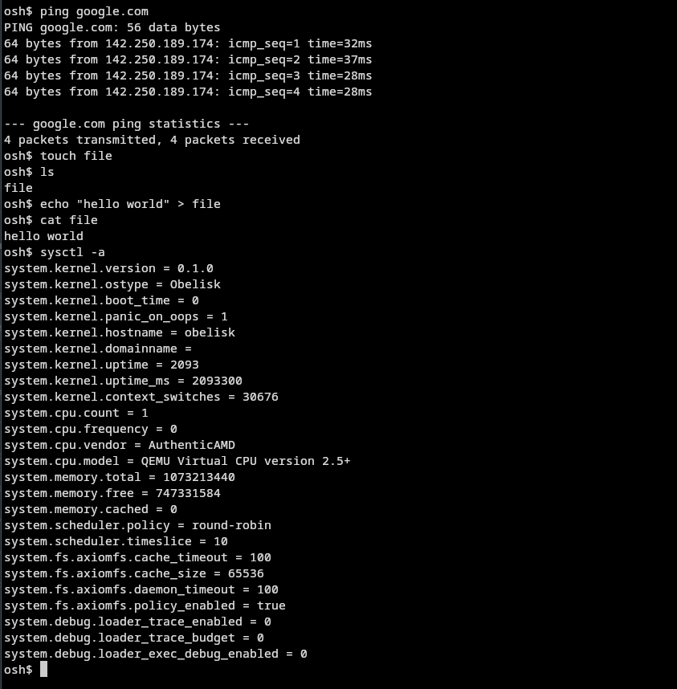
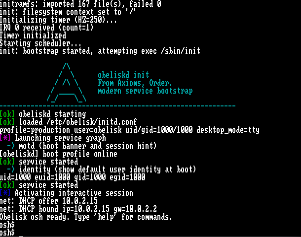

# Obelisk OS, the not so minimal, minimal UNIX-like kernel.

# Minimalist and educational in nature, born from nightmares.

<div align="center">


<br>

<a href="https://www.c-language.org/"></a> <a href="https://isocpp.org"></a> <a href="https://dlang.org"></a> <a href="https://www.gnu.org/software/bash/"></a> <a href="https://www.gnu.org/software/make/"></a> <a href="https://www.swi-prolog.org/"></a> <a href="https://ziglang.org/"></a> <a href="https://en.wikipedia.org/wiki/Assembly_language"></a>

<br><br>

**From Axioms, Order.**

</div>

---

### Welcome newcomers! this repo has just passed basic testing and now has become public. Feel free to read source code, and jump through docs.

**Also, i lost my sanity in some of the network drivers, ignore that.**

**Please go to docs directory and see scaffolds, and roadmaps. Contributions needed, and welcomed always!**

Obelisk is a standalone Unix-like OS focused on a practical minimal base system
that is CLI-first and desktop-capable. (in the future, desktop support in works)

> Repo: [https://github.com/RobertFlexx/ObeliskOS](https://github.com/RobertFlexx/ObeliskOS)

---

## Screenshots

<div align="center">
  
  
</div>

---

## Official Target Profile

> ObeliskOS does NOT have working xdm or xfce yet.

Obelisk is converging on one clear daily-usable path:

* minimal, stable Unix-like base system
* official desktop environment: **XFCE**
* official display/login manager: **XDM**
* official package manager: **opkg**
* package ecosystem: **binary-first `.opk` delivery**
* single supported desktop path first (no KDE/GNOME parity work in this phase)

> *future opkg repo mirror [here](https://github.com/RobertFlexx/obelisk-pkg)*

This project values coherence and reliability over feature count.

---

## System Philosophy

* Keep the base system small, auditable, and recoverable
* Prefer traditional Unix behavior where practical
* Keep TTY shell as the safe fallback path
* Treat desktop support as an extension of a stable base, not a separate OS
* Ship practical milestones, avoid speculative mega-abstractions

---

## Current Architecture

* **Kernel**: monolithic x86_64 kernel in C with assembly bootstrap paths
* **Filesystem**: AxiomFS and VFS/devfs stack
* **Control surface**: `sysctl`-first operational model
* **Userland**: small libc + compact base tools + `rockbox` shell/tool multiplexer
* **Packages**: native `opkg` and `.opk` repository flow

> ***OBELISK OPKG IS NOT OPENWRT OPKG!***
> **OPKG in-environment isn't stable, static local repository. web-repos in progress, contribs? please? lol**
---

## Languages Used

<div align="center">

<a href="https://en.wikipedia.org/wiki/C_(programming_language)">C</a> • <a href="https://isocpp.org">C++</a> • <a href="https://dlang.org">D</a> • <a href="https://www.gnu.org/software/bash/">Shell</a> • <a href="https://www.gnu.org/software/make/">Makefile</a> • <a href="https://www.swi-prolog.org/">Prolog</a> • <a href="https://ziglang.org/">Zig</a> • <a href="https://en.wikipedia.org/wiki/Assembly_language">Assembly</a>

</div>

---

## Repository Layout

* `kernel/` - kernel source
* `userland/` - user programs, libc, init/session tools
* `opkg/` - package manager and package examples
* `docs/` - project direction, roadmap, and release docs
* `rootfs-overlay/` - optional rootfs overlay content
* `Makefile` - top-level build and ISO packaging

---

## Build Prerequisites

* `x86_64-elf-gcc` toolchain (or `CROSS_COMPILE=<prefix>`)
* GNU Make
* GRUB 2 tooling (`grub-mkrescue`)
* QEMU
* `tar`

To build a cross-compiler with the helper script:

```bash
./tools/mkaxiomfs/cross-compile.sh
export PATH="$HOME/opt/cross/bin:$PATH"
```

---

## Build and Run

Build full artifact set:

```bash
make
```

Component builds:

```bash
make kernel
make userland
make rootfs
make iso
```

Run:

```bash
make run
make run-gui
make run-kvm
```

Debug boot:

```bash
make debug
```

Clean:

```bash
make clean
```

---

## Roadmap and Policy Docs (if u wanna see whats next in the future & what to expect)

* Newcomer repo map / placement guide: `docs/repository-map.md`
* Main phased plan: `docs/roadmap.md`
* Desktop/XDM path: `docs/desktop-roadmap.md`
* Packaging policy and package waves: `docs/packaging-policy.md`
* Release gate checklist: `docs/RELEASE_CHECKLIST.md`
* Installer details: `docs/INSTALLER.md`

---

## Release Direction

Obelisk is pre-1.0 (not stable!!!) . "Release-ready" currently means:

* reproducible builds and installable artifacts
* stable boot/session fallback behavior
* predictable package install/update/remove flow
* documented known gaps and validation gates

---

## Inspirations

<p align="center">
  <a href="https://www.openbsd.org/">
    
  </a>
  <a href="https://www.netbsd.org/">
    
  </a>
  <a href="https://www.kernel.org/">
    
  </a>
  <a href="https://en.wikipedia.org/wiki/Unix">
    
  </a>
</p>

<br><br>

<a href="https://www.openbsd.org/"><strong>OpenBSD</strong></a> — comments style, minimalism and hardware handling <a href="https://www.netbsd.org/"><strong>NetBSD</strong></a> — philosophy <a href="https://www.kernel.org/"><strong>Linux</strong></a> — printk <a href="https://en.wikipedia.org/wiki/Unix"><strong>UNIX</strong></a> — philosophy

</div>

---

## Credits / Testers

* bigguy118 is now tester
* Kokonico is now tester

---

## License

This project is licensed under the **BSD-3-Clause** license.
See [`LICENSE`](LICENSE) for details.
